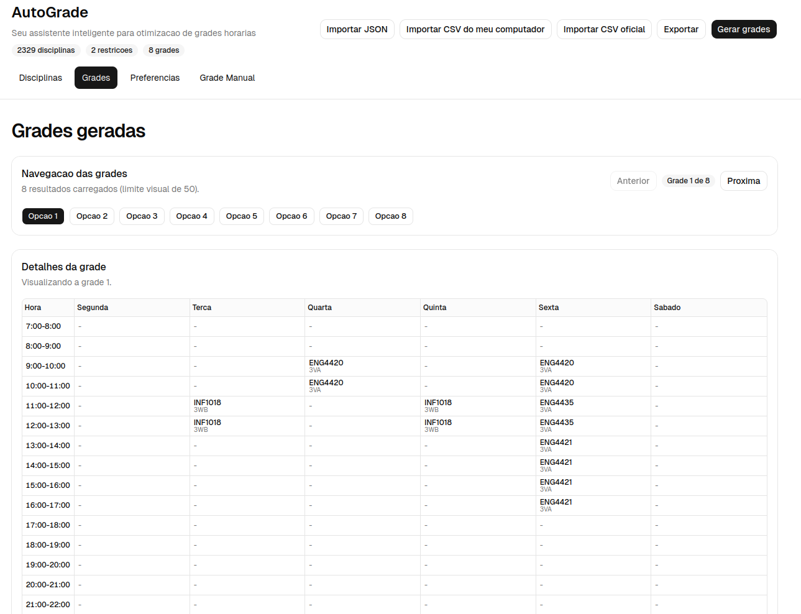

# Autograde

**live at: https://autograde-c9b.pages.dev**

A web app to help PUC-Rio students build their semester schedule.

Every semester, PUC-Rio students go through the same ritual: staring and clicking around at the official UI of course offerings, trying to figure out which combination of classes fits together the best. Class schedules conflict, students fight over vacancies (if you don't click in the UI fast enough, someone will enroll before you), and some of us lose a lot of time optimizing our schedules.

Originally inspired by a project built in a Modular Programming course, Autograde's goal is to give students full control over their preferences and constraints, and let the algorithm generate all valid schedules that match.

---

## How to use it

If you want to use the official course data (last updated March 18, 2026), click **"Importar CSV Oficial"**.

For the most up-to-date data, export directly from [PUC-Rio's schedule](https://www.puc-rio.br/microhorario) as a CSV (search with no filters, then export). Open and re-save the file in a spreadsheet app to normalize its internal formatting, then upload it via the CSV import button.

> **Important:** add at least one **"Available Courses"** preference to tell the algorithm which courses you're actually considering for the semester. Without this, the search space is too large to be useful.

---

## Tech

- React 19 with React Compiler
- Vite 7, TypeScript 5.8 strict
- File-based routing with TanStack Router (fully typed search params)
- State management with Zustand v5 + persist
- Forms with TanStack Form + Zod v4 at all domain boundaries
- UI with shadcn/ui on top of Radix, styled with Tailwind v4
- CSV parsing with PapaParse
- Tests with Vitest, fast-check (property-based testing), and Playwright for E2E
- Static deploy on Cloudflare Pages, no backend, everything runs in the browser. Don't build a server when you don't need one.
- Package manager: pnpm